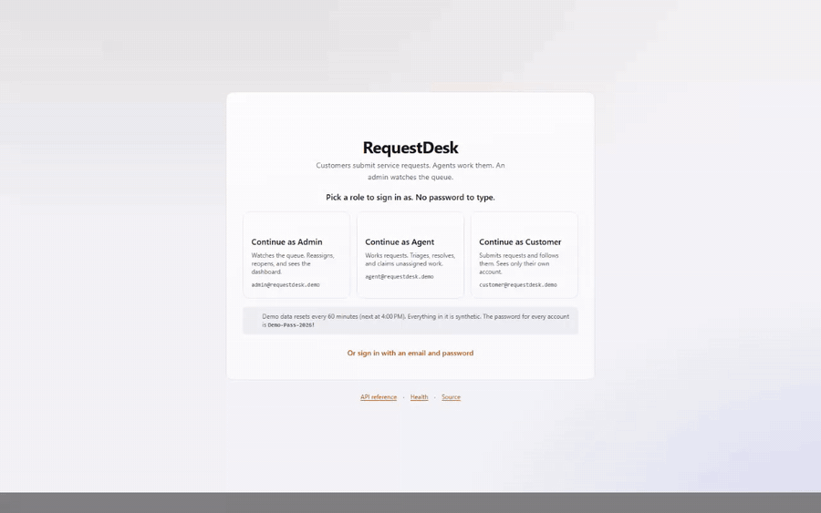
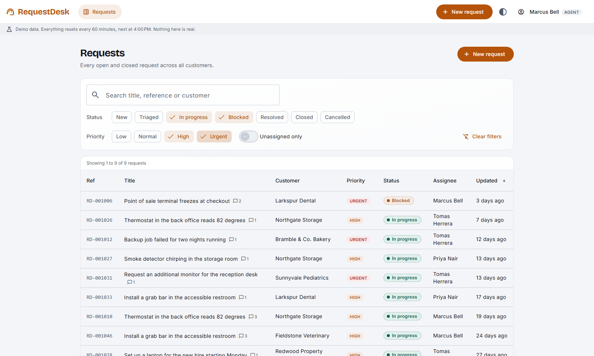
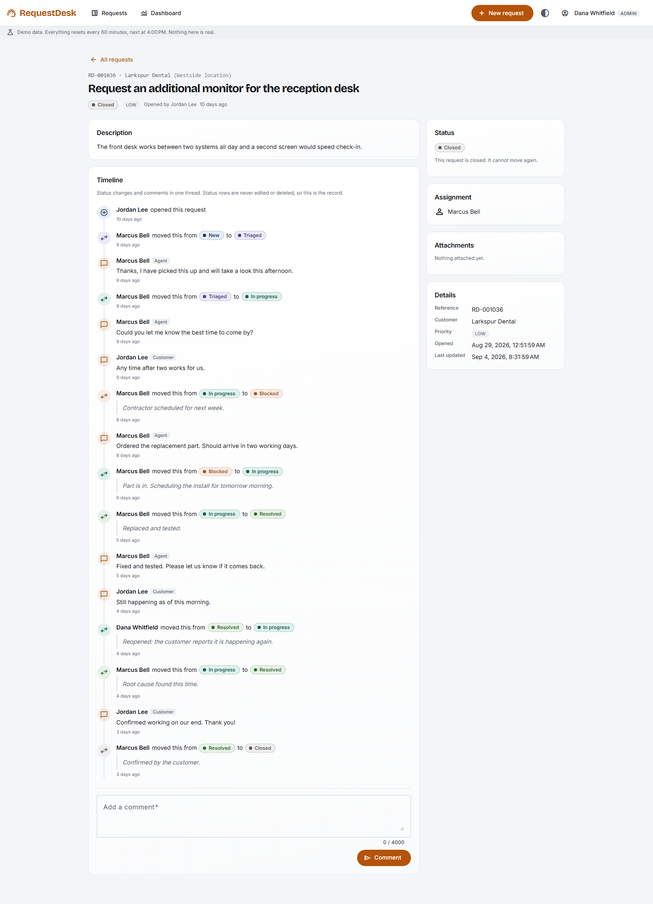
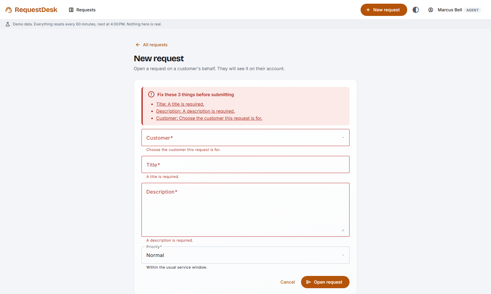
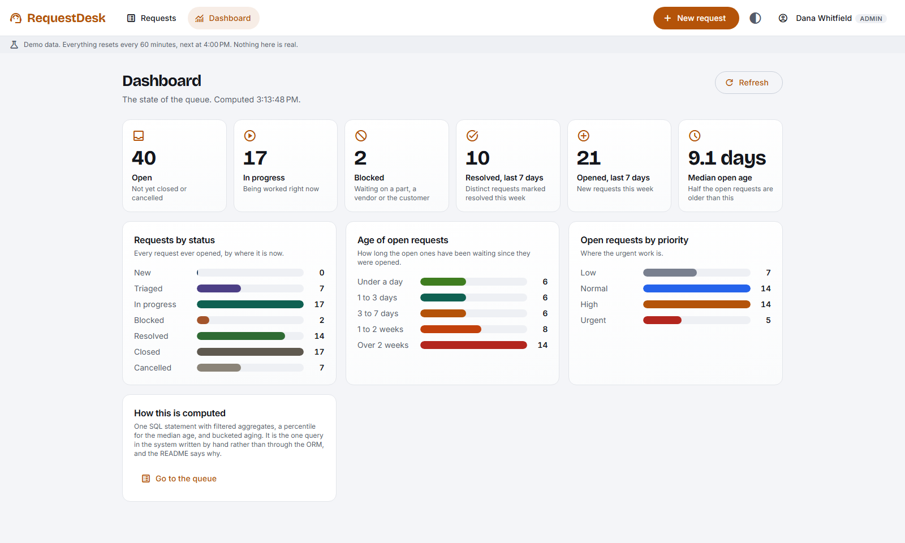
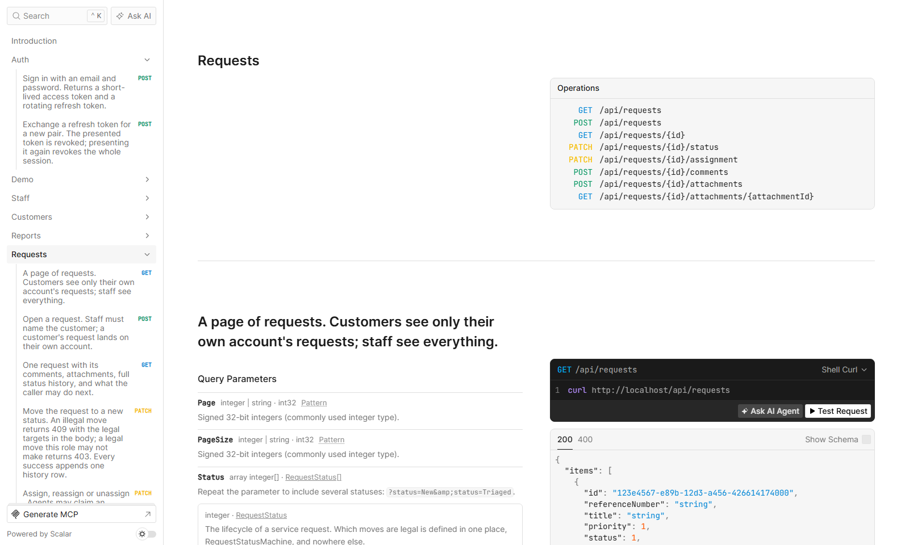
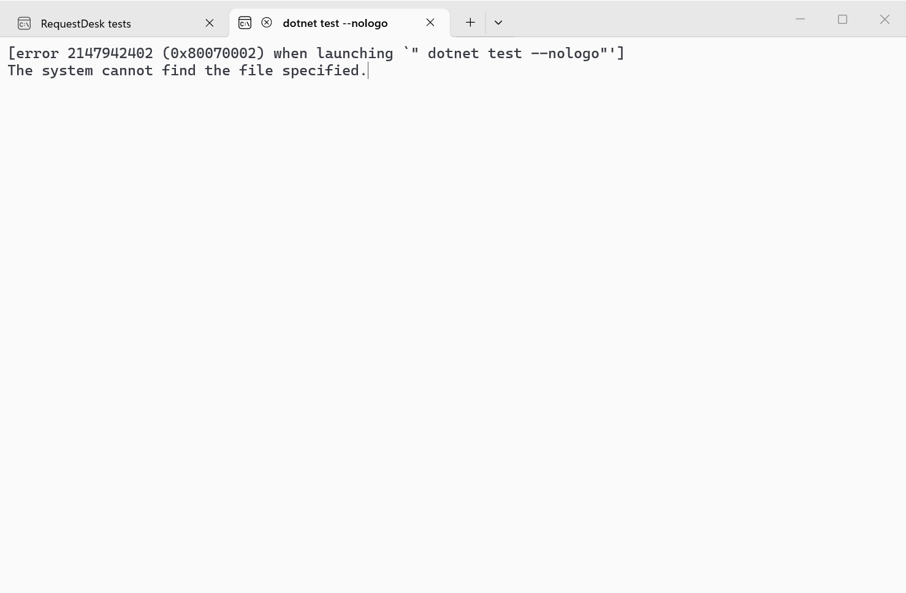
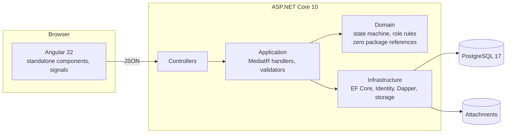

# RequestDesk

A service request tracker: customers submit requests, agents work them, an admin watches the queue.
ASP.NET Core 10 and PostgreSQL behind an Angular 22 front end, with a status state machine, an
append-only history, role-based access, file attachments, a SQL reporting query, server-side paging,
and three tiers of tests, one of them against a real database.

**Live demo: <https://requestdesk.eric-patton.dev>.** Sign in with one click as any of the three roles.
The data is synthetic and resets every hour. Demo logins, also shown as buttons on the sign-in screen:

| Role | Email | Password |
|---|---|---|
| Admin | `admin@requestdesk.demo` | `Demo-Pass-2026!` |
| Agent | `agent@requestdesk.demo` | `Demo-Pass-2026!` |
| Customer | `customer@requestdesk.demo` | `Demo-Pass-2026!` |



Nothing in that recording is staged. It is
[`web/e2e/screenshots.spec.ts`](web/e2e/screenshots.spec.ts) driving the real application through a
real browser, and the same file regenerates every screenshot in this README, so the pictures cannot
quietly stop matching the software.

[](https://github.com/eric-patton/requestdesk/actions/workflows/ci.yml)


[](LICENSE)

## Run it locally

```sh
git clone https://github.com/eric-patton/requestdesk.git
cd requestdesk
docker compose up --build
```

Then open <http://localhost:8085> and pick a role. That is PostgreSQL, the API (migrated and
seeded with synthetic data) and the front end behind nginx, on one command. The API is also on
<http://localhost:5028> directly, with an interactive API reference at `/scalar` and a health check
at `/health` that really does check the database. The live demo exposes the same two:
<https://requestdesk.eric-patton.dev/scalar> and <https://requestdesk.eric-patton.dev/health>.

<details>
<summary>Screenshots</summary>

The request list, filtered to in-progress and blocked work at high and urgent priority. Every filter,
the search, the sort and the page are applied on the server.



A request's detail page. Status changes and comments share one timeline; the status rows are the
append-only record. The buttons on the right are exactly the moves the API said this user may make.



The new request form, refusing to submit. The error summary is announced to screen readers and each
item focuses its field.



The admin dashboard, fed by one SQL query.



The API reference, generated from the code.



The full test run.



</details>

## What it does

A small business logs service requests. A **customer** opens one, follows it, comments, and can
cancel it. An **agent** triages it, works it, marks it blocked or resolved, and claims unassigned
work. An **admin** can do all of that plus reassign, reopen, and read the dashboard.

Every request moves through a fixed set of statuses:

```
New         ->  Triaged | Cancelled
Triaged     ->  InProgress | Cancelled
InProgress  ->  Blocked | Resolved
Blocked     ->  InProgress | Cancelled
Resolved    ->  Closed | InProgress    (reopen, admin only)
Closed      ->  terminal
Cancelled   ->  terminal
```

Every legal move writes a history row that nothing can edit or delete afterwards. An illegal move is
a `409` whose body lists the legal ones. A legal move the caller's role may not make is a `403`. A
request the caller may not see is a `404`, not a `403`, so nothing leaks about other customers.

## Architecture



Dependencies point inward. The domain project has no package references at all, which you can
confirm by opening its `.csproj`. The application layer is commands, queries, validators and the
interfaces that infrastructure implements. Infrastructure owns EF Core, the identity store, the one
Dapper query, file storage and the demo seeder. The API is controllers, auth wiring, problem
details, OpenAPI and health. [docs/architecture.md](docs/architecture.md) walks one request end to
end and has the data model.

## Stack

| Layer | Choice | Why |
|---|---|---|
| Runtime | .NET 10, ASP.NET Core with controllers | Controllers rather than minimal APIs, because this is the shape of the enterprise work it demonstrates. |
| Mediation | MediatR 12.5 | Handlers per use case with a validation pipeline. Pinned to the last Apache-2.0 release; [ADR 0004](docs/decisions/0004-mediatr-12-and-the-licence-line.md) says why. |
| Validation | FluentValidation | One validator per command, and the Angular form mirrors the same limits from one constants file each side. |
| Data | EF Core 10 on PostgreSQL, code-first migrations | snake_case naming, a sequence-backed reference number, `xmin` as the concurrency token. |
| Reporting | Dapper, one query | Filtered aggregates, a percentile and bucketed ages in one round trip. [ADR 0002](docs/decisions/0002-dapper-for-the-reporting-query.md). |
| Auth | ASP.NET Core Identity credentials, JWT bearer, three roles | Fifteen-minute access tokens, rotating refresh tokens stored hashed, replay revokes the session, sign-in rate limited. |
| Storage | Local disk behind an `IFileStorage` interface | Random keys, outside the web root, streamed back through the API. Shaped for an S3 swap. |
| Front end | Angular 22, standalone components, signals, Angular Material | Reactive forms whose validation mirrors the server, a keyboard-navigable table, an accessible error summary. |
| Design | A shared design system, vendored in `web/src/design-system/` | The same tokens and components as [eric-patton.dev](https://eric-patton.dev), so the demo and the page that links to it are visibly one product. |
| API tests | xUnit, Testcontainers PostgreSQL, `WebApplicationFactory` | Real HTTP against a real database. [ADR 0003](docs/decisions/0003-testcontainers-over-in-memory.md). |
| Front-end tests | Vitest unit tests, Playwright end to end | The Playwright run goes through the compose stack in CI. |
| CI | GitHub Actions | Build with warnings as errors, migrations drift check, all tests, container builds, the e2e run, Terraform validate. |
| Hosting | Docker on a Mac Mini behind a Cloudflare Tunnel | The compose stack, a production override that publishes only the front end on localhost, and an outbound-only tunnel. No open ports, no monthly bill. [docs/hosting-mac-mini.md](docs/hosting-mac-mini.md). |
| IaC | Terraform for ECS Fargate, RDS and S3 | Committed and validated, deliberately not applied. [infra/terraform](infra/terraform/README.md). |

## If you are evaluating me and have ten minutes

Read these five files, in this order:

1. [`RequestStatusMachine.cs`](api/src/RequestDesk.Domain/Requests/RequestStatusMachine.cs), every legal transition in one place, no framework.
2. [`RequestStatusMachineTests.cs`](api/tests/RequestDesk.Domain.Tests/RequestStatusMachineTests.cs), the exhaustive 49-pair matrix, plus [`RequestPolicyTests.cs`](api/tests/RequestDesk.Domain.Tests/RequestPolicyTests.cs) crossing every status with every role.
3. [`StatusTransitionTests.cs`](api/tests/RequestDesk.Api.IntegrationTests/StatusTransitionTests.cs), the same matrix proven over real HTTP against a real PostgreSQL, and [`AppendOnlyHistoryTests.cs`](api/tests/RequestDesk.Api.IntegrationTests/AppendOnlyHistoryTests.cs), which tries to tamper with the history through raw SQL and through EF Core and watches both fail.
4. [`SummaryQuery.cs`](api/src/RequestDesk.Infrastructure/Reporting/SummaryQuery.cs), the one place SQL is used, and why.
5. [`0001-append-only-status-history.md`](docs/decisions/0001-append-only-status-history.md), a trade-off written down.

Then, if you have five more: [`ServiceRequest.cs`](api/src/RequestDesk.Domain/Requests/ServiceRequest.cs) is the aggregate every change goes through, and
[`request-detail.ts`](web/src/app/features/requests/request-detail.ts) is the front end rendering only what the API allowed.

## The API

| Method | Route | Notes |
|---|---|---|
| `POST` | `/api/auth/login` | Access token plus rotating refresh token. Rate limited. |
| `POST` | `/api/auth/refresh` | Rotates the refresh token; reuse revokes the session. |
| `GET` | `/api/requests` | Server-side paging, filter by status, priority and assignee, search, sort. Customers see their own account only. |
| `GET` | `/api/requests/{id}` | With comments, attachments, full history, the legal next statuses and what the caller may do. |
| `POST` | `/api/requests` | Validated; `201` with the database-assigned reference number. |
| `PATCH` | `/api/requests/{id}/status` | Enforces the state machine; `409` with the legal set on an illegal move. |
| `PATCH` | `/api/requests/{id}/assignment` | Agents claim unassigned work; admins reassign or clear. |
| `POST` | `/api/requests/{id}/comments` | |
| `POST` | `/api/requests/{id}/attachments` | Multipart, 10 MB cap, allowlisted content types, open requests only. |
| `GET` | `/api/requests/{id}/attachments/{attachmentId}` | Streamed through the API with the stored content type. |
| `GET` | `/api/reports/summary` | The dashboard numbers, in SQL. Admin only. |
| `GET` | `/api/staff`, `/api/customers` | Lookups for the assignment and new-request controls. Staff only. |
| `GET` | `/api/demo` | The demo accounts and next reset time. `404` unless demo mode is on. |
| `GET` | `/health`, `/health/live` | Readiness checks the database; liveness only says the process is up. |

The interactive reference at `/scalar` is generated from the code and always current.

## Working on it

The API and the front end run separately in development, against the compose database.

```sh
docker compose up postgres                 # PostgreSQL on localhost:5440
cd api && dotnet run --project src/RequestDesk.Api    # http://localhost:5028, migrates and seeds
cd web && npm install && npm start          # http://localhost:4200, proxies /api to the API
```

```sh
cd api && dotnet test                       # 288 tests; the integration tier needs Docker
cd web && npm test                          # 22 unit tests
cd web && npx playwright test               # 3 end-to-end tests against http://localhost:8085
cd web && npx playwright test --project screenshots   # regenerate docs/screenshots and demo.webm
```

Adding a migration: `cd api && dotnet ef migrations add <Name> --project src/RequestDesk.Infrastructure --startup-project src/RequestDesk.Api --output-dir Persistence/Migrations`. CI fails if the model and the snapshot drift.

## Demo mode and what protects it

With `Demo:Enabled` on, the API seeds a deterministic synthetic data set at startup (eight invented
small businesses, sixty requests walked through plausible histories, no real names, addresses or
anything from anyone's life) and wipes and reseeds it at the top of every hour. The sign-in screen
says so. Beyond that: the auth endpoints are rate limited per IP, uploads are capped and allowlisted
and stored under random keys outside the web root, tokens are short lived and hashed at rest, and
the API sends nothing outbound. Nothing here is real, and nothing here can send email.

## What I deliberately did not build

No notifications or email. No SLA engine. No multi-tenancy beyond the customer scope. No search
server. No soft delete, because nothing is deleted. No S3 implementation of `IFileStorage`, only the
interface shaped for one and the Terraform bucket it would target. No light theme: the design
system commits to one ground rather than half-building two. Naming the edge of the scope is part
of the work.

## Tests

| Tier | Count | What it proves |
|---|---|---|
| Domain | 160 | The 49-pair transition matrix, every status crossed with every role, the aggregate's invariants. Milliseconds, no I/O. |
| Application | 35 | Handlers with test doubles, validators field by field, the validation pipeline. |
| API integration | 93 | Real HTTP against a real PostgreSQL in Docker: the matrix again, append-only enforcement at both layers, auth and refresh rotation, paging, filtering, uploads, the report adding up. |
| Web unit | 27 | Error mapping, relative time, status verbs, the shell, theme switching. |
| End to end | 3 | A browser signing in, opening a request, triaging it, commenting; the customer and admin views. |

318 in total, all green in CI on every push.

## License

[MIT](LICENSE).
