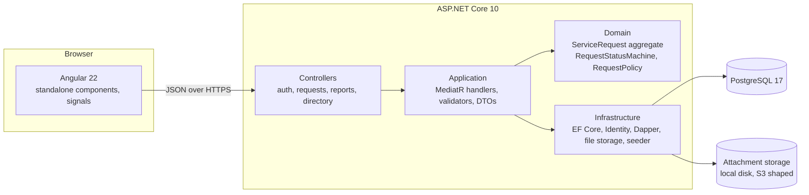
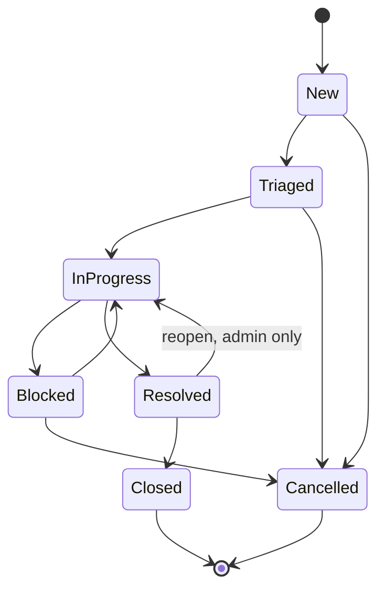
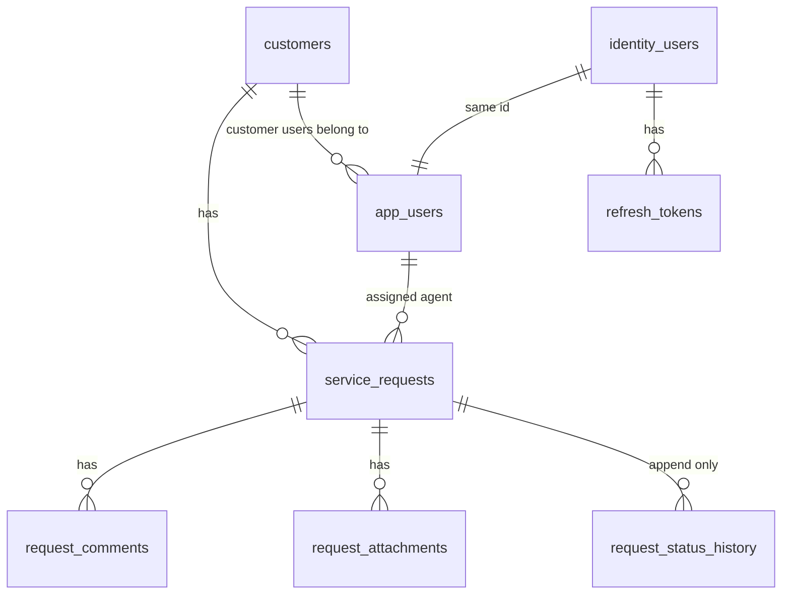

# Architecture

RequestDesk is a small line-of-business application built the way a larger one should be: a domain
layer with no framework in it, an application layer of commands and queries, an infrastructure layer
that owns the database and the identity store, and a thin API on top. An Angular front end talks to
the API over HTTP and never guesses at permissions.

## The layers, and what may depend on what

| Project | Depends on | Owns |
|---|---|---|
| `RequestDesk.Domain` | nothing | Entities, the status state machine, the role rules, invariants. Zero package references, and the `.csproj` says why. |
| `RequestDesk.Application` | Domain, MediatR, FluentValidation | Commands and queries, their validators and handlers, the DTOs the API returns, the interfaces Infrastructure implements. |
| `RequestDesk.Infrastructure` | Application, EF Core, Identity, Dapper | The `DbContext` and migrations, repositories, the read store, the reporting query, JWT issuance, file storage, demo seeding. |
| `RequestDesk.Api` | Infrastructure | Controllers, authentication and authorisation wiring, problem details, OpenAPI, health checks, startup. |

Dependencies point inward. Nothing in Domain knows there is a database; nothing in Application
knows it is EF Core.

## One request, end to end

`PATCH /api/requests/{id}/status` with `{ "to": "Triaged", "reason": "..." }`:

1. The controller builds a `ChangeStatusCommand` and hands it to MediatR.
2. `ValidationBehavior` runs the command's validator: the target status is a known value, the reason
   is under the limit. A failure is a 400 with one entry per field.
3. `ChangeStatusCommandHandler` loads the aggregate through `IServiceRequestRepository`. If the
   caller may not see the request, that is a 404, not a 403: a customer learns nothing about other
   customers' ids.
4. `ServiceRequest.ChangeStatus` checks legality against `RequestStatusMachine` (an illegal move
   throws with the legal set, which becomes a 409 carrying `legalTransitions`), then permission
   against `RequestPolicy` (a legal move this role may not make is a 403), then appends one
   `RequestStatusHistory` row and updates the status.
5. `IUnitOfWork.SaveChangesAsync` writes both. The `xmin` concurrency token turns a lost update into
   a 409. The append-only interceptor would refuse any history modification; here there is none.
6. The response carries the new status, the history entry, and the legal moves from the new status,
   so the UI can redraw its buttons without a second request.

## The status machine

`RequestStatusMachine` says what is legal. `RequestPolicy` says who may do it:

| Role | May |
|---|---|
| Customer | See, comment on and cancel requests on their own account. Open new ones. |
| Agent | Everything on every request except reopen and reassign. Claim unassigned work. |
| Admin | Everything, including reopen, reassign and the dashboard. |

The API returns `allowedTransitions` and a `permissions` object on every request detail. The front
end renders exactly those and nothing else.

## Data

- `identity_users` holds credentials (ASP.NET Core Identity). `app_users` holds the profile the
  domain refers to: display name, role, and for customers the account they belong to. They share a
  primary key, and the domain never references the Identity types.
- `service_requests.reference_number` is assigned by PostgreSQL from a sequence
  (`RD-001000`, `RD-001001`, ...), so it is unique under concurrency and not guessable from the id.
- `request_status_history` is protected three ways; see [ADR 0001](decisions/0001-append-only-status-history.md).
- Ids are version 7 GUIDs, generated by the domain, so the primary key indexes append rather than
  scatter.

## Authentication

Sign-in returns a fifteen-minute JWT and a seven-day refresh token. Refresh tokens rotate on every
use; only their SHA-256 hash is stored. Presenting a token that has already been rotated revokes
every live token for that user, on the assumption that a replay means a copy got out. The auth
endpoints are rate limited per IP.

## What was deliberately not built

No notifications or email. No SLA engine. No multi-tenancy beyond the customer scope. No search
server; `ILIKE` over three columns is enough for the data volume this is for. No soft delete;
nothing is deleted. No file previews; attachments are stored under random keys and streamed back
through the API with their stored content type.
